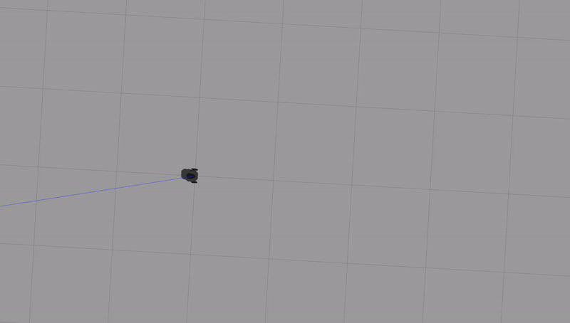

# warmup_project

## Driving in a Square
__High Level Description__ 
My objective with this behavior is self-explanatory: make the robot drive in a square.  My approach was to create two functions which give the robot the ability to turn left and drive straight in separate motions.  Then, I used these functions to create a loop that causes the robot to drive in a square. 

__Code Explanation__ 
*straight* 
This function causes the robot to drive in a straight line for a fixed distance before stopping.  In the context of the problem, it represents one side of a square.  
*turn* 
This function causes the robot to turn left 90 degrees.  In the context of the problem, this function runs when the robot has finished one side of the square and must turn before beginning the next side  
*run* 
This function loops through the *straight* and *turn* functions 4 times, creating a square.
  

\

## Wall Follower
__High Level Description__ 

__Code Explanation__ 

## Person Follower
__High Level Description__ 

__Code Explanation__ 

\

## Challenges

## Future Work

## Takeaways
